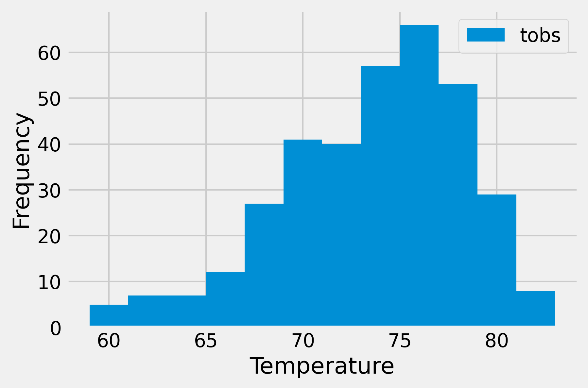

# SQLAlchemy Homework - Surfs Up!
Week 10 - Homework

In preparation for a long holiday vacation in Honolulu, Hawaii the following analysis has been completed to assist with planning an epic trip.


# Assignment structure
```
sqlalchemy-challenge
|__ .gitignore                                # Gitignore file
|__ app.py                                    # Flask
|__ climate_starter.ipynb                     # Jupyter notebook
|__ README.md                                 # Markdown README
| 
|__ images/                                   # Contains matplotlib plots
|   |__ MostActiveStn_Temp_Histogram.png      # Matplotlib Histogram
|   |__ Precipitation_BarGraph.png            # Matplotlib Bar Graph
|
|__ Resources/                                # Contains source data files
|   |__ hawaii.sqlite                         # Sqlite Database
|   |__ hawaii_measurements.csv               # Measurement CSV file
|   |__ hawaii_stations.csv                   # Station CSV file

```


# Usage

```
# Pandas
import pandas as pd

# Dependencies
import numpy as np
%matplotlib inline
from matplotlib import style
style.use('fivethirtyeight')
import matplotlib.pyplot as plt

# Python SQL toolkit and Object Relational Mapper
import sqlalchemy
from sqlalchemy.ext.automap import automap_base
from sqlalchemy.orm import Session
from sqlalchemy import create_engine, func, inspect

```

# Datasets 

|No|Source|Link|
|-|-|-|
|1|hawaii.sqlite|https://github.com/alysnow/sqlalchemy-challenge/blob/main/Resources/hawaii.sqlite|
|2|hawaii_measurements.csv|https://github.com/alysnow/sqlalchemy-challenge/blob/main/Resources/hawaii_measurements.csv|
|3|hawaii_stations.csv|https://github.com/alysnow/sqlalchemy-challenge/blob/main/Resources/hawaii_stations.csv|


# Climate Analysis and Exploration

Use Python and SQLAlchemy to complete a basic climate analysis and data exploration of your climate database. A copy of the jupyter notebook is located in the following link;

https://github.com/alysnow/sqlalchemy-challenge/blob/main/climate_starter.ipynb

## Precipitation Analysis:

* Design a query to retrieve the last 12 months of precipitation data.
* Select only the date and prcp values.
* Load the query results into a Pandas DataFrame and set the index to the date column.
* Sort the DataFrame values by date.
* Plot the results using the DataFrame plot method.

### Twelve Month Precipitation Bar Graph


## Station Analysis:

* Design a query to calculate the total number of stations.
* Design a query to find the most active stations.
** List the stations and observation counts in descending order.
** Which station has the highest number of observations?
* Design a query to retrieve the last 12 months of temperature observation data (TOBS).
** Filter by the station with the highest number of observations.
** Plot the results as a histogram with bins=12.

### Most Active Station Histogram




# Climate App

Design a Flask API based on the queries that you have just developed in the jupyter notebook.

Utilizing the Visual Studio Code to generate a Flask API to create routes. A copy of the py file is located in the following link;

https://github.com/alysnow/sql-challenge/blob/main/app.py


# Contributor
- [Alysha Snowden](https://github.com/alysnow)